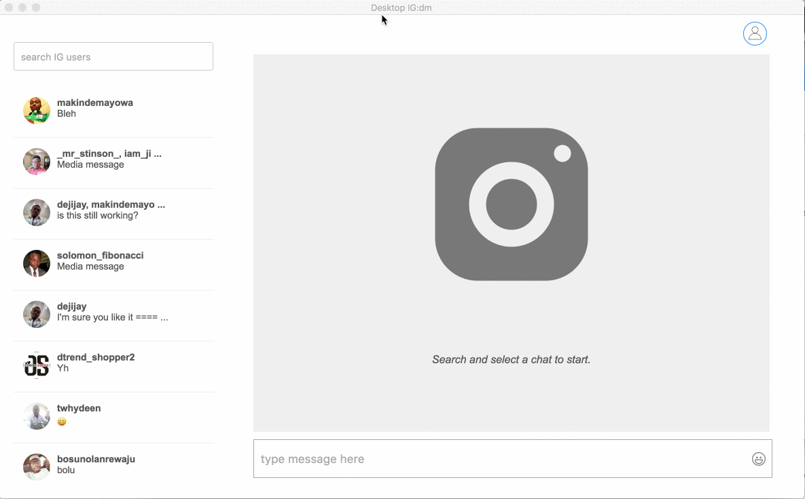

# igdmanage
Conexion con mensajes pregrabados

### View Website
[here](https://github.com/arestrepoco/igdmanage/)

### Preview

### Local Development

1. Ensure you Node.js installed. [See](https://nodejs.org/en/download/)

2. Clone this repo by running the command - `git clone https://github.com/arestrepoco/igdmanage.git`

3. Navigate to the directory where the repo is cloned to. (e.g `cd igdmanage`)

4. Run `yarn install` to install all the dependencies.

5. Start the application locally by running `yarn start`

That's it! :) Now you can have those pull requests rolling in! :D

## License

[GNU GENERAL PUBLIC LICENSE](LICENSE).
